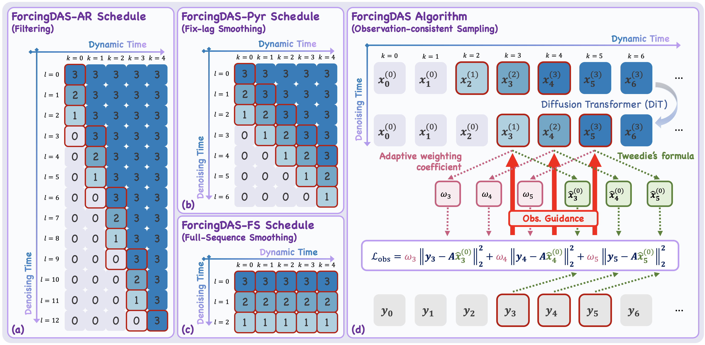
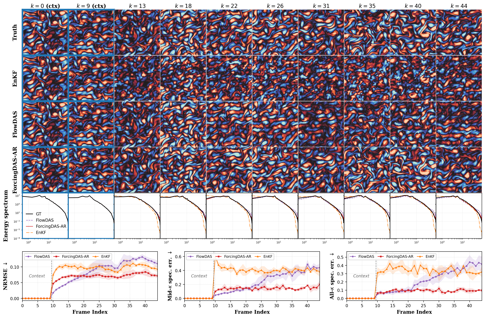
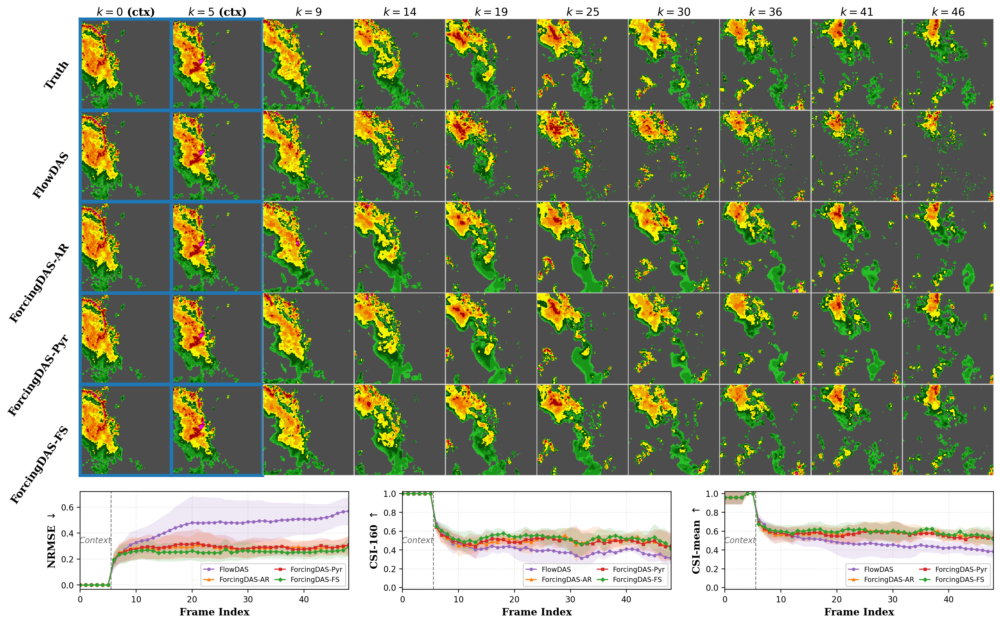

# ForcingDAS: Unified and Robust Data Assimilation via Diffusion Forcing

<p align="center">
  
</p>

**ForcingDAS** is a unified and robust framework for **data assimilation (DA)** — estimating the
state of an evolving dynamical system from noisy, partial observations. A single trained model
spans the full **filtering → smoothing** spectrum (nowcasting, fixed-lag smoothing, and batch
reanalysis), with the DA regime selected purely at inference time. By learning a *joint-trajectory*
prior with an independent noise level on each frame, ForcingDAS captures long-horizon temporal
dependencies and reduces the error accumulation that plagues frame-to-frame transition models.

We evaluate ForcingDAS on three domains:

- **Navier–Stokes** (2D vorticity)
- **SEVIR** (precipitation nowcasting)
- **ERA5** (global atmospheric state estimation)

<p align="center">
  
</p>
<p align="center">
  
</p>
<p align="center">
  
</p>

> Code release for the paper *ForcingDAS: Unified and Robust Data Assimilation via Diffusion
> Forcing* (Jia et al.).

---

## Contents
- [Installation](#installation)
- [Datasets and Checkpoints](#datasets-and-checkpoints)
- [Training](#training)
- [Data Assimilation at Inference](#data-assimilation-at-inference)
- [Repository Structure](#repository-structure)
- [Citation](#citation)
- [Acknowledgements](#acknowledgements)

---

## Installation

```bash
conda create -n forcingdas python=3.10 -y
conda activate forcingdas
pip install -r requirements.txt
```

Training and evaluation log to [Weights & Biases](https://wandb.ai/). Run `wandb login` once, then
set your entity/project in `configurations/config.yaml` (the `wandb.entity` / `wandb.project`
fields). To run without cloud logging, append `wandb.mode=offline` (or `disabled`) to any command.

The code automatically uses CUDA, Apple-Silicon MPS, or CPU when available.

## Datasets and Checkpoints

### Datasets

The preprocessed validation tensors and the pretrained checkpoints are hosted together in one
Hugging Face repository:
**[umjiayx18/ForcingDAS-data-and-ckpts](https://huggingface.co/datasets/umjiayx18/ForcingDAS-data-and-ckpts)**.

Download everything with:

```bash
hf download umjiayx18/ForcingDAS-data-and-ckpts --repo-type dataset --local-dir ./forcingdas-assets
```

Validation data lives under `data/<domain>/` (checkpoints under `ckpts/`):

| Domain | `dataset.data_dir` |
|--------|--------------------|
| Navier–Stokes | `./forcingdas-assets/data/ns` |
| SEVIR | `./forcingdas-assets/data/sevir` |
| ERA5 | `./forcingdas-assets/data/era5` |

Point the corresponding `dataset.data_dir` at the domain folder (either edit
`configurations/dataset/<name>.yaml` or pass `dataset.data_dir=/path/to/data` on the command line).

**Expected folder layout.** Each dataset directory holds `train/`, `val/`, and (for ERA5) `test/`
subfolders, each containing a single tensor file:

```
<data_dir>/
├── train/data.pt      # (or data.npy for SEVIR)
├── val/data.pt
└── test/data.pt       # ERA5 only
```

**Tensor shape.** Each file stores one tensor of shape `(B, L, C, H, W)`:

- `B` — number of trajectories
- `L` — sequence length (time steps)
- `C` — channels / physical variables (`C=1` for Navier–Stokes and SEVIR; `C>1` for ERA5)
- `H, W` — spatial resolution

Format / normalization conventions per domain:

| Domain | File | dtype | Convention |
|--------|------|-------|------------|
| Navier–Stokes | `data.pt` (torch) | float32 | stored as `(B, L, H, W)`; loader adds the channel axis |
| SEVIR | `data.npy` (numpy, lazy-loaded) | float32 | stored as `(B, L, H, W)`, values in `[0, 1]` |
| ERA5 | `data.pt` (torch) | float32 | `(B, L, C, H, W)`, **z-score normalized per channel** using training statistics |

### Pretrained checkpoints

Trained ForcingDAS checkpoints (DiT backbone) live under `ckpts/` in the same repository:
**[umjiayx18/ForcingDAS-data-and-ckpts](https://huggingface.co/datasets/umjiayx18/ForcingDAS-data-and-ckpts/tree/main/ckpts)**
(included in the `hf download` above).

Pass a downloaded checkpoint to inference with `load=/path/to/checkpoint.ckpt`, or set `CKPT_PATH`
at the top of the `scripts/test_*.sh` scripts.

## Training

All experiments launch through a single entry point with [Hydra](https://hydra.cc) config
composition (no `argparse`). Pick a domain via the `algorithm` / `experiment` / `dataset` triple,
and override any nested field on the command line.

```bash
# Navier–Stokes
python -m main +name=ns_train algorithm=df_ns experiment=exp_ns dataset=ns_vorticity \
    dataset.data_dir=/path/to/ns dataset.n_frames=50

# SEVIR
python -m main +name=sevir_train algorithm=df_sevir experiment=exp_sevir dataset=sevir_vil \
    dataset.data_dir=/path/to/sevir

# ERA5
python -m main +name=era5_train algorithm=df_era5 experiment=exp_era5 dataset=era5 \
    dataset.data_dir=/path/to/era5
```

Each domain has a 3D U-Net backbone (`df_ns` / `df_sevir` / `df_era5`) and a DiT backbone
(`df_ns_dit` / `df_sevir_dit` / `df_era5_dit`); swap by changing the `algorithm` argument.

Ready-to-edit launch scripts live in [`scripts/`](scripts): each exposes all hyperparameters
(backbone size, batch size, learning rate, noise schedule, etc.) as variables at the top of the
file — set them there, or override any as an environment variable (e.g.
`LR=1e-4 bash scripts/train_ns.sh`). Replace the `/path/to/...` and `CKPT_PATH` placeholders first.
To resume a run append `resume=<wandb_run_id>`; to load a checkpoint into a fresh run use
`load=<wandb_run_id_or_path>`.

## Data Assimilation at Inference

A single trained model covers the full filtering-to-smoothing spectrum. The DA regime is selected
**at inference only**, by the noise-level **scheduling matrix** (`algorithm.scheduling_matrix`)
together with `chunk_size` and `uncertainty_scale` — no retraining required:

| DA regime | `scheduling_matrix` | `chunk_size` | Description |
|-----------|---------------------|--------------|-------------|
| Filtering / nowcasting | `autoregressive` | `1` | one frame denoised at a time (causal) |
| Fixed-lag smoothing | `pyramid` | `-1` | staggered multi-frame denoising (`uncertainty_scale=1`) |
| Batch reanalysis | `full_sequence` | `-1` | all frames denoised jointly at the same level |

### Observation guidance

Assimilation conditions the joint-trajectory prior on observations `y = A(x) + noise` through a
per-frame, **noise-level-aware observation-guidance** term. Each frame's correction is scaled by its
current signal quality, which keeps the solver robust over long horizons. Configure it under the
`algorithm.obs_guidance` block (disabled by default):

```bash
python -m main +name=ns_da algorithm=df_ns experiment=exp_ns dataset=ns_vorticity \
    dataset.data_dir=/path/to/ns experiment.tasks=[test] \
    algorithm.scheduling_matrix=pyramid algorithm.chunk_size=-1 algorithm.uncertainty_scale=1 \
    algorithm.obs_guidance.enabled=true \
    algorithm.obs_guidance.operator.name=sparse_observation \
    algorithm.obs_guidance.operator.ratio=0.10 \
    algorithm.obs_guidance.noise_sigma=0.05 \
    algorithm.obs_guidance.grad_scale=1.0 \
    load=<wandb_run_id_or_ckpt_path>
```

Key `obs_guidance` fields:

| Field | Meaning |
|-------|---------|
| `enabled` | turn observation guidance on/off |
| `operator.name` | forward operator: `identity`, `super_resolution`, or `sparse_observation` |
| `operator.scale_factor` | downsampling factor for `super_resolution` |
| `operator.ratio`, `H`, `W`, `seed` | kept-pixel fraction and mask geometry for `sparse_observation` |
| `noise_sigma` | observation noise std (in unnormalized data space) |
| `grad_scale` | guidance step size |
| `gamma` | noise-level-aware variance inflation (`0` disables) |
| `spectral_lambda`, `spectral_ref`, `spectral_sharpness` | optional spectral regularization (see below) |

The optional spectral regularizer needs a reference power spectrum. Precompute one from training
data with [`scripts/compute_reference_spectrum.py`](scripts/compute_reference_spectrum.py) and pass
its path via `algorithm.obs_guidance.spectral_ref=...`.

## Repository Structure

```
ForcingDAS/
├── main.py                 # Hydra entry point
├── algorithms/
│   └── diffusion_forcing/  # df_base → df_video (shared base) → df_{ns,sevir,era5}
│       ├── models/         # diffusion process, 3D U-Net, DiT
│       ├── operators.py    # forward operators A(x) for observations
│       └── spectral_utils.py
├── configurations/         # Hydra configs: algorithm / dataset / experiment / cluster
├── datasets/               # navier_stokes / sevir / era5 loaders
├── experiments/            # Lightning experiment classes + registry
├── scripts/                # launch scripts + spectrum / metric utilities
└── utils/                  # logging, checkpoint, cluster helpers
```

Add a new domain by registering it in four places keyed by the same name: a config YAML under
`configurations/{algorithm,dataset,experiment}/`, the dataset loader, the algorithm class
(`algorithms/diffusion_forcing/__init__.py`), and the experiment registry
(`experiments/__init__.py`, `experiments/exp_video.py`).

## Citation

If you find this work useful, please cite:

```bibtex
@misc{jia2026forcingdasunifiedrobustdata,
      title={ForcingDAS: Unified and Robust Data Assimilation via Diffusion Forcing}, 
      author={Yixuan Jia and Siyi Chen and Yida Pan and Xiao Li and Lianghe Shi and Chanyong Jung and Haijie Yuan and Ismail Alkhouri and Yue Cynthia Wu and Saiprasad Ravishankar and Jeffrey A Fessler and Qing Qu},
      year={2026},
      eprint={2605.14285},
      archivePrefix={arXiv},
      primaryClass={eess.IV},
      url={https://arxiv.org/abs/2605.14285}, 
}
```

## Acknowledgements

This repository is built on the [Diffusion Forcing](https://github.com/buoyancy99/diffusion-forcing)
code base by Boyuan Chen et al., which is itself forked from Boyuan Chen's research-template repo.
Per its MIT license, this attribution is retained here and in `LICENSE`.

```bibtex
@article{chen2024diffusion,
  title   = {Diffusion forcing: Next-token prediction meets full-sequence diffusion},
  author  = {Chen, Boyuan and Mart{\'\i} Mons{\'o}, Diego and Du, Yilun and
             Simchowitz, Max and Tedrake, Russ and Sitzmann, Vincent},
  journal = {Advances in Neural Information Processing Systems},
  year    = {2024}
}
```
